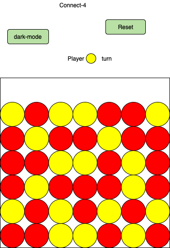
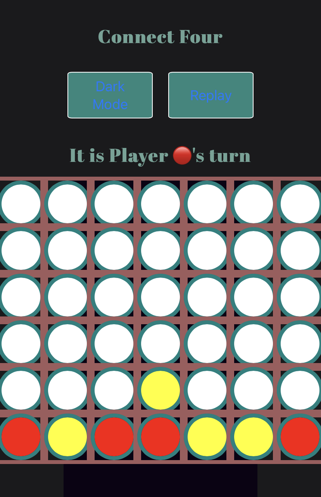

# connect-Four
Board Game

This a classic board Game Connect four is a two-player game where players alternate taking tokens and placing them in the board. The first player to get 4 in a row either vertically,horizontal, or diagonally wins!

[Play the game here ](https://ah82021.github.io/connect-Four/).

Wireframe: 

display on small screens: 

Desktop dispay :

# Languages 
 *HTML  
 *Javascript  
 *CSS 